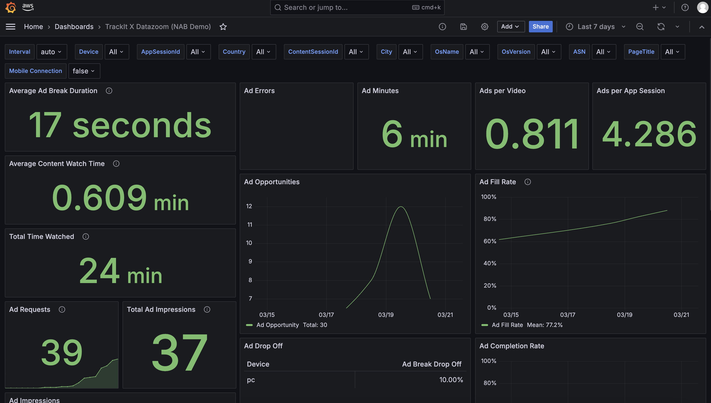
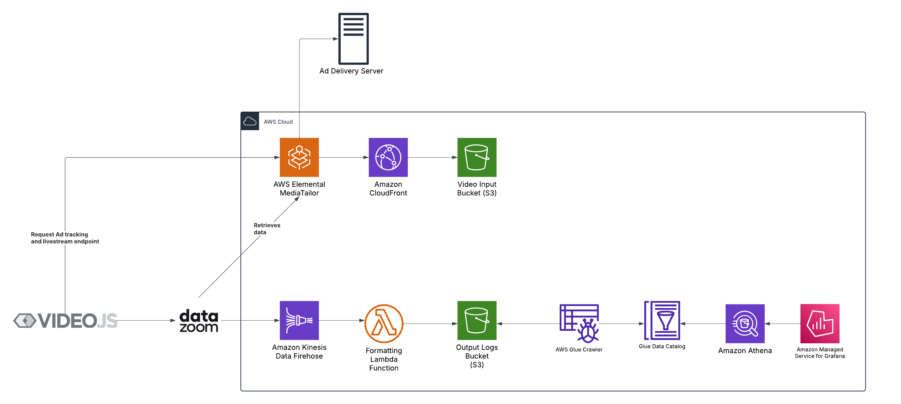

# AWS Managed Grafana Dashboard powered by Datazoom and MediaTailor

<p align="center">
  
</p>

This project utilizes AWS Managed Grafana and Kinesis Firehose to create a dashboard that visualizes ad performance data powered by Datazoom and MediaTailor.
Datazoom collects and processes ad performance data directly from client-side video players and sends it to Kinesis Firehose for further processing.
Kinesis Firehose then delivers the data to Amazon S3, where it is stored and made available to AWS Glue for data cataloging and querying using Amazon Athena. The data is then visualized in AWS Managed Grafana.

## Architecture Overview

<p align="center">
  
</p>

Datazoom collects and processes video playback and ad performance data directly from client-side video players and sends it to Kinesis Firehose. Kinesis Firehose then delivers the data to Amazon S3, where it is cataloged using AWS Glue and made available for querying using Amazon Athena. The data is visualized in AWS Managed Grafana for real-time insights.

## Prerequisites

Before deploying the stack, ensure you have:
1. **AWS SAM CLI** installed. ([Installation Guide](https://docs.aws.amazon.com/serverless-application-model/latest/developerguide/install-sam-cli.html))
2. Configured **AWS credentials** with the necessary permissions.

## Deployment

1. Clone this repository and navigate to the root directory.
2. Run the deployment script:
   ```bash
   $ sam build
   $ sam deploy
   ```
3. The stack will be deployed to your AWS account.

## Post-Deployment Configuration

### Create IAM Access Key for Firehose User

1. Go to the **IAM** service in the AWS console.
2. Find the IAM user named: `${AWS::StackName}-firehose-user-access`
3. Generate an **Access Key** for this user.
4. Save the **Access Key ID** and **Secret Access Key**.

### Grant Access to Grafana Dashboard

1. Navigate to the **AWS Managed Grafana** service page.
2. Add the users who need access to the dashboard.
3. They can be **Admin, Editor or Viewer**

## Datazoom Resources

### Configure Datazoom Kinesis Connector

1. In Datazoom, create a **Kinesis Connector**.
2. Put the name of your Kinesis Firehose Delivery Stream: `PUT-S3-${AWS::StackName}`
3. Select your region.
4. Put the **Access Key** and **Secret Access Key** from the previous step.

### Configure Datazoom Collector
1. In Datazoom, select the collector of your choice, can be Video.JS.
2. If you're using any **ADS** (Ad decision server), please select **Player Default** in the Ad Framework section.
3. Then, in the **integration** section, you can copy your `configuration_id`. You'll need it to setup the SDK and be able to collect data.

### Configure Datazoom Data Pipes
1. In Datazoom, you can create a new data pipe.
2. Select the collector of your choice on the left and the connector on right.
3. Save and you should be able to collect data now.

### Additional Notes
- Ensure that the Datazoom SDK is properly configured to send metadata to Kinesis.
- If you encounter issues, check CloudFormation stack logs for debugging.
- The Grafana dashboard is pre-configured but can be customized further as needed.


# License

Copyright 2025 TrackIt

Licensed under the Apache License, Version 2.0 (the "License");
you may not use this file except in compliance with the License.
You may obtain a copy of the License at [LICENSE.md](./LICENSE.md)

Unless required by applicable law or agreed to in writing, software
distributed under the License is distributed on an "AS IS" BASIS,
WITHOUT WARRANTIES OR CONDITIONS OF ANY KIND, either express or implied.
See the License for the specific language governing permissions and
limitations under the License.

