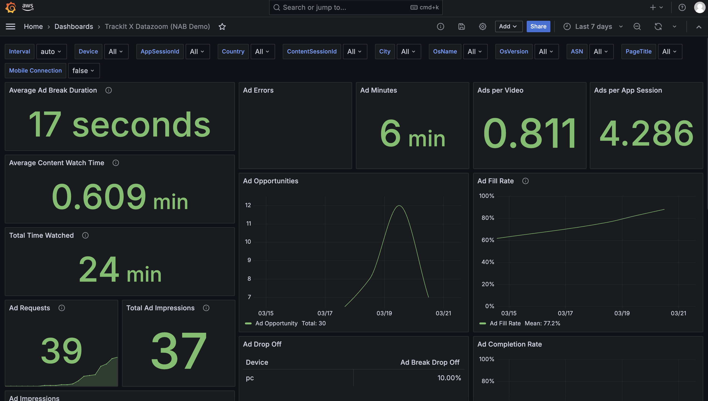

# AWS Managed Grafana Dashboard powered by Datazoom and MediaTailor



This project utilizes AWS Managed Grafana and Kinesis Firehose to create a dashboard that visualizes ad performance data powered by Datazoom and MediaTailor.
Datazoom collects and processes ad performance data directly from client-side video players and sends it to Kinesis Firehose for further processing.
Kinesis Firehose then delivers the data to Amazon S3, where it is stored and made available to AWS Glue for data cataloging and querying using Amazon Athena. The data is then visualized in AWS Managed Grafana.

## Architecture diagram


# Deployment

## Prerequisites

- [AWS SAM CLI](https://docs.aws.amazon.com/serverless-application-model/latest/developerguide/install-sam-cli.html)

## Deployment steps

### AWS Data processing resources

To deploy the data processing resources on AWS using the AWS SAM client, run the following commands:

```bash
$ sam build
$ sam deploy
```

### Datazoom Resources

> [!IMPORTANT]
> If you do not already have a [collector](https://www.datazoom.io/collectors) set up, follow [these steps](./media-tailor-setup/README.md) set up a MediaTailor channel and Datazoom collector.

# License

Copyright 2025 TrackIt

Licensed under the Apache License, Version 2.0 (the "License");
you may not use this file except in compliance with the License.
You may obtain a copy of the License at

  [LICENSE.md](./LICENSE.md)

Unless required by applicable law or agreed to in writing, software
distributed under the License is distributed on an "AS IS" BASIS,
WITHOUT WARRANTIES OR CONDITIONS OF ANY KIND, either express or implied.
See the License for the specific language governing permissions and
limitations under the License.